__MySong application:__ Native Android application to search music by your favorite artist and filter, where you can add to your fav-list, see the top 10 songs nowadays. Also, you can sign in, as a normal user or admin user to handle (delete or add non-admin users).

__Tools:__ 

* Kotlin as Language
* Dagger, dependency injection
* AndroidX & Material Components, for updated views and MutableLiveData
* ViewBinding & ProguardFiles for build features
* Retrofit2, REST API client for iTunes search API & iTunes Store API (TOP 10 hit songs)
* CardView & ViewPager2, for animations and API responses 
* VIPER ARCHITECTURE (Not implemented at all)
* Threads & coroutines, for database, API calls, and music player 
* ROOMs, local database
* GLIDE & Picasso for images and animations
* MediaPlayer, for 15-sec songs
* JUnit & MOckito for implementation and Unit Test  (Not implemented at all)

__Apk :__ it's at the apk folder :-) 

__Images:__

* Onboarding:

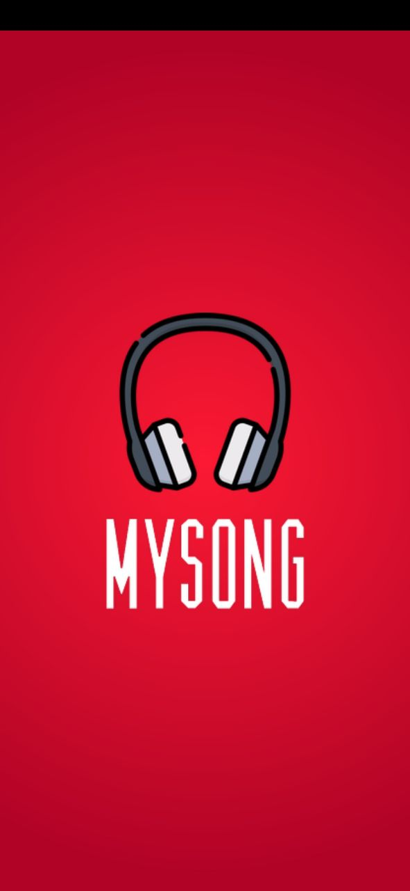

* Top 10 songs 

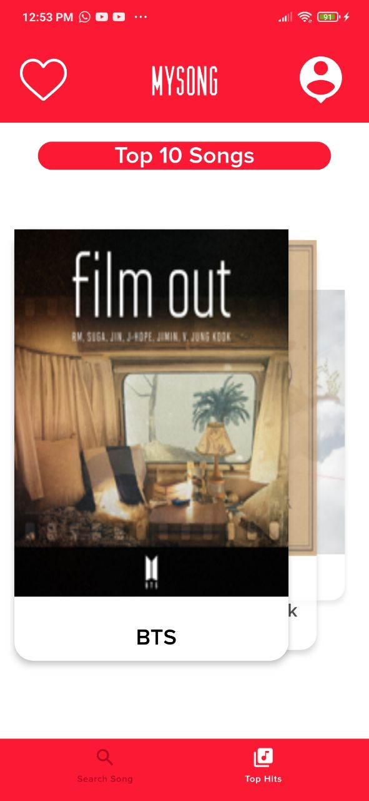

* Non-login users search:

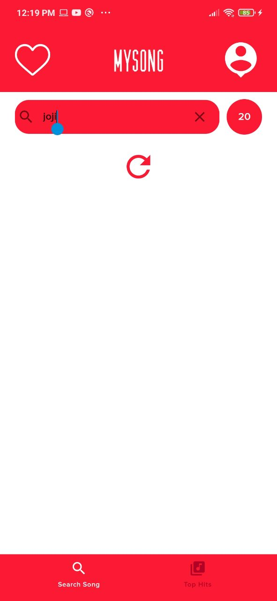
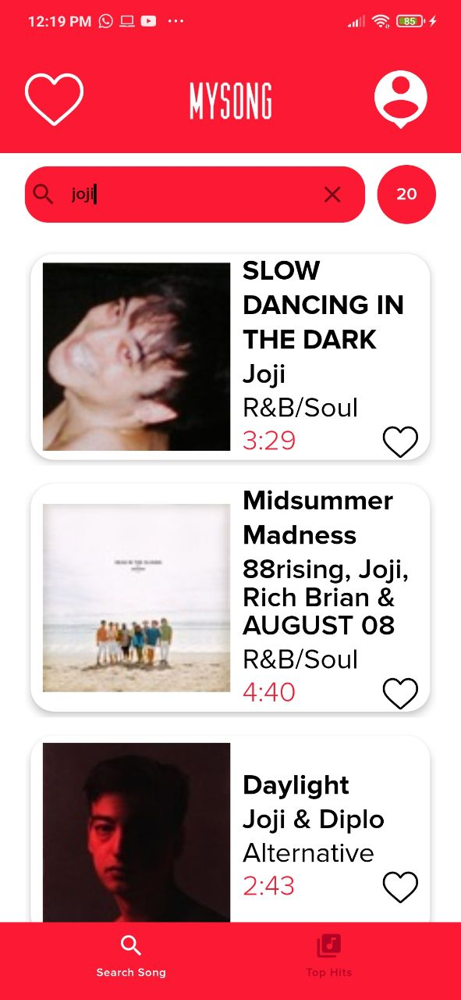
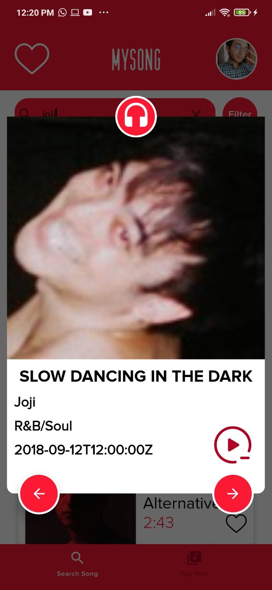

* Login

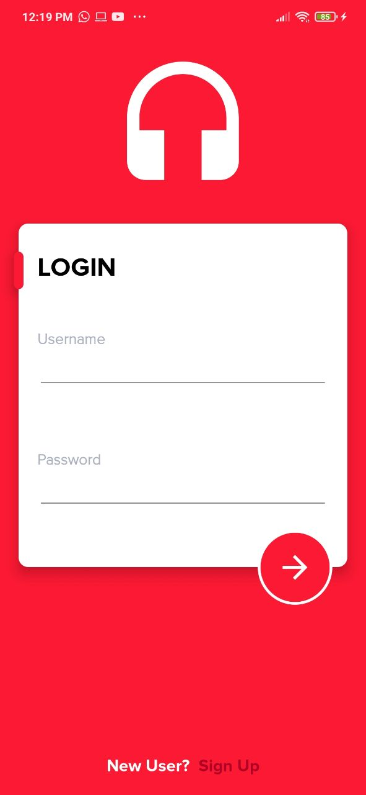

* Register

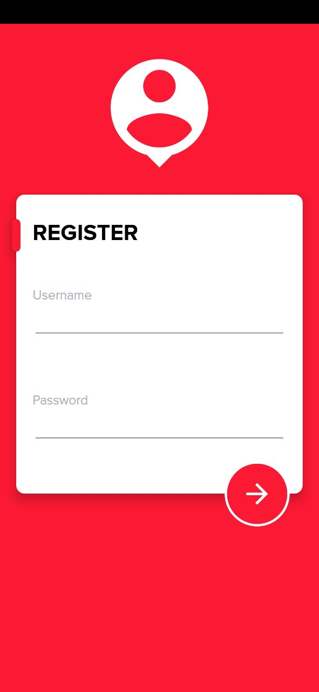

* Loading Animation

* Users:

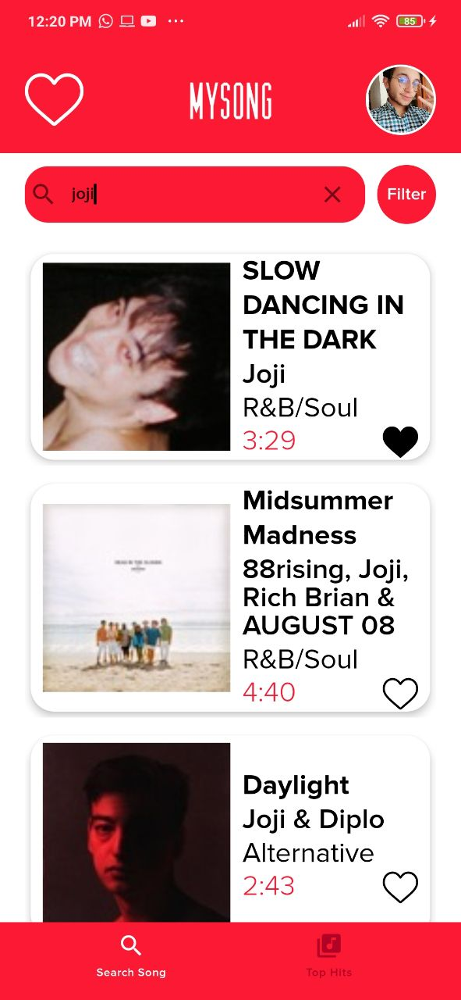
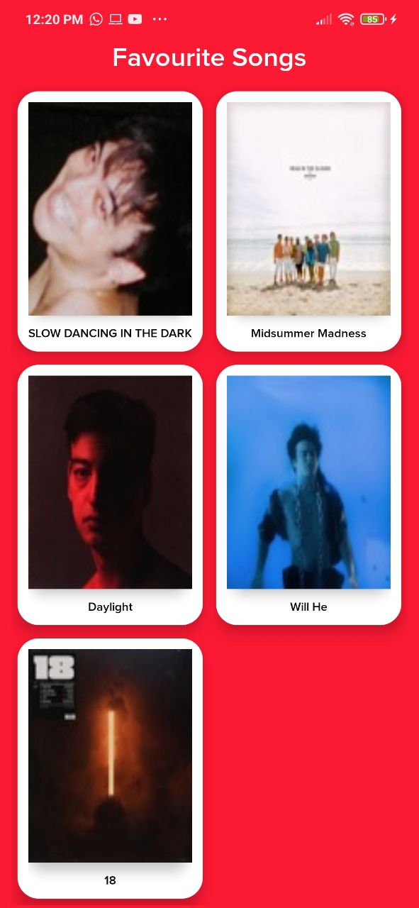
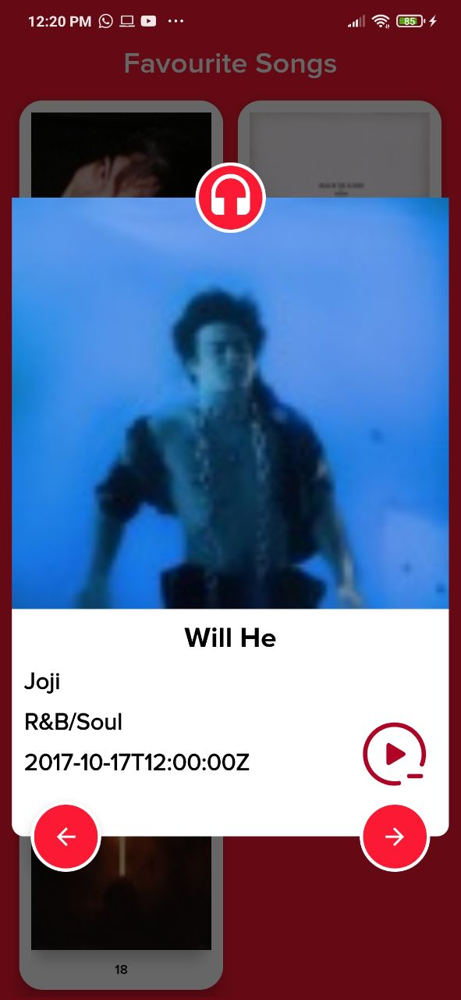

* Admin user:

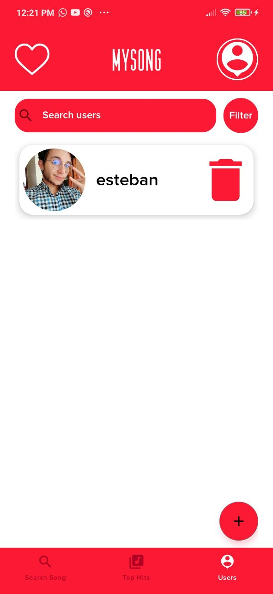
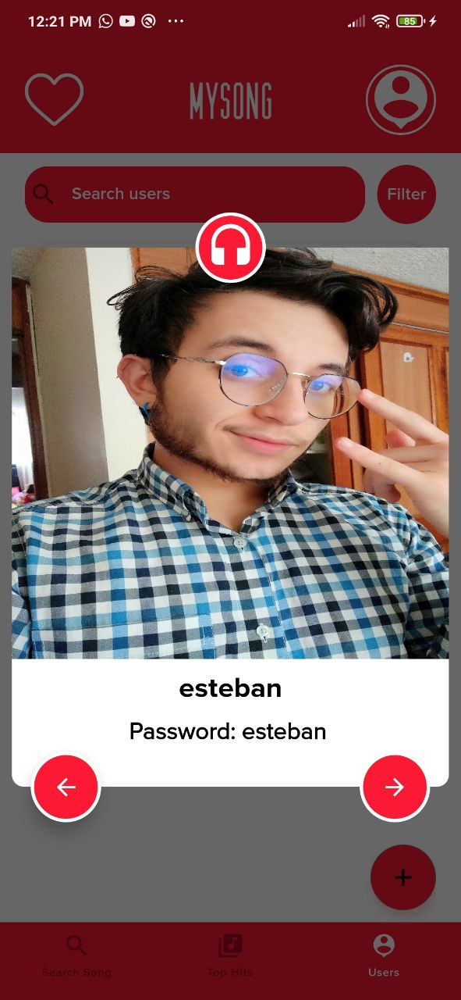
